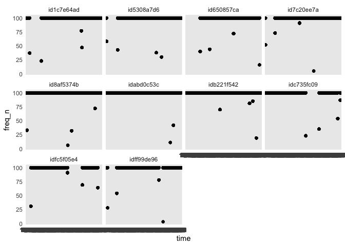
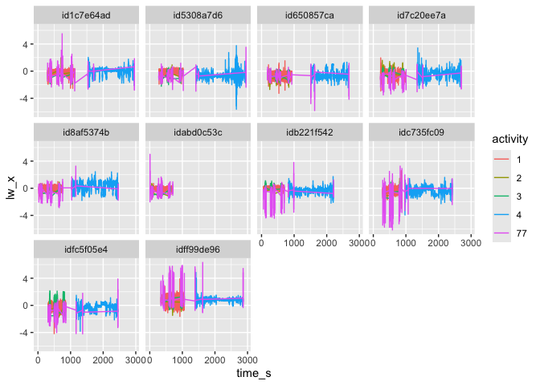
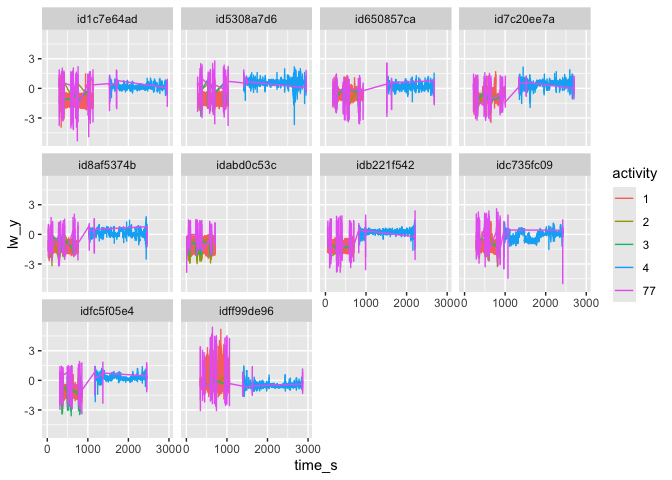
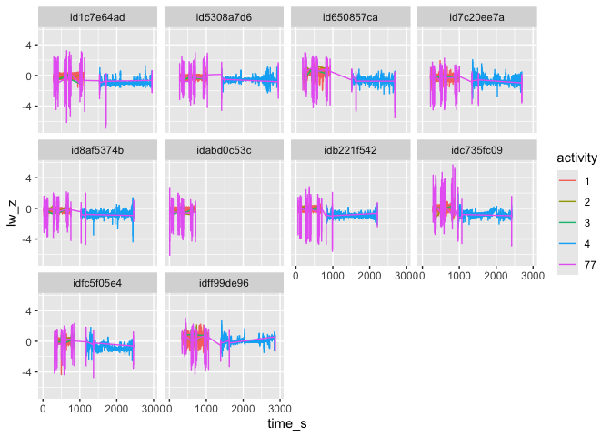
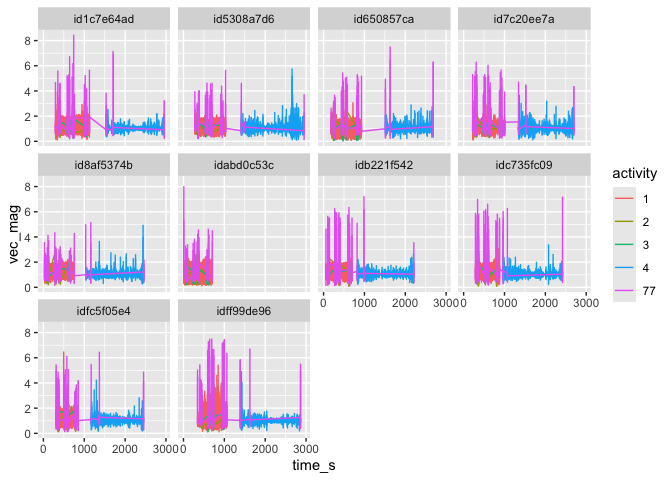

``` r
knitr::opts_chunk$set(echo = TRUE)
library(tidyverse)
```

```
## ── Attaching core tidyverse packages ──────────────────────── tidyverse 2.0.0 ──
## ✔ dplyr     1.1.4     ✔ readr     2.1.5
## ✔ forcats   1.0.0     ✔ stringr   1.5.1
## ✔ ggplot2   3.5.1     ✔ tibble    3.2.1
## ✔ lubridate 1.9.4     ✔ tidyr     1.3.1
## ✔ purrr     1.0.2     
## ── Conflicts ────────────────────────────────────────── tidyverse_conflicts() ──
## ✖ dplyr::filter() masks stats::filter()
## ✖ dplyr::lag()    masks stats::lag()
## ℹ Use the conflicted package (<http://conflicted.r-lib.org/>) to force all conflicts to become errors
```

``` r
library(BiostatsUHNplus)
library(lubridate)
library(stringr)
library(seewave)
```

```
## 
## Attaching package: 'seewave'
## 
## The following object is masked from 'package:lubridate':
## 
##     duration
## 
## The following object is masked from 'package:readr':
## 
##     spec
```

``` r
library(signal)
```

```
## 
## Attaching package: 'signal'
## 
## The following object is masked from 'package:seewave':
## 
##     unwrap
## 
## The following object is masked from 'package:dplyr':
## 
##     filter
## 
## The following objects are masked from 'package:stats':
## 
##     filter, poly
```

``` r
library(gsignal)
```

```
## Registered S3 methods overwritten by 'gsignal':
##   method         from  
##   plot.grpdelay  signal
##   plot.specgram  signal
##   print.freqs    signal
##   print.freqz    signal
##   print.grpdelay signal
##   print.impz     signal
##   print.specgram signal
## 
## Attaching package: 'gsignal'
## 
## The following objects are masked from 'package:signal':
## 
##     Arma, as.Arma, as.Zpg, bartlett, bilinear, blackman, boxcar,
##     butter, buttord, cheb1ord, chebwin, cheby1, cheby2, chirp, conv,
##     decimate, ellip, ellipord, fftfilt, filter, filtfilt, fir1, fir2,
##     flattopwin, freqs, freqs_plot, freqz, freqz_plot, gausswin,
##     grpdelay, hamming, hanning, ifft, impz, interp, kaiser, kaiserord,
##     levinson, Ma, medfilt1, poly, remez, resample, sftrans, sgolay,
##     sgolayfilt, specgram, triang, unwrap, Zpg, zplane
## 
## The following objects are masked from 'package:seewave':
## 
##     hilbert, rms, unwrap
## 
## The following object is masked from 'package:lubridate':
## 
##     dst
## 
## The following object is masked from 'package:dplyr':
## 
##     filter
## 
## The following objects are masked from 'package:stats':
## 
##     filter, gaussian, poly
```

## Data Break


``` r
data <- read_csv("data_clean.csv")
```

```
## Rows: 2937600 Columns: 10
## ── Column specification ────────────────────────────────────────────────────────
## Delimiter: ","
## chr (2): id, gender
## dbl (8): age, weight_lbs, right_handed, activity, time_s, lw_x, lw_y, lw_z
## 
## ℹ Use `spec()` to retrieve the full column specification for this data.
## ℹ Specify the column types or set `show_col_types = FALSE` to quiet this message.
```

``` r
glimpse(data)
```

```
## Rows: 2,937,600
## Columns: 10
## $ id           <chr> "id1c7e64ad", "id1c7e64ad", "id1c7e64ad", "id1c7e64ad", "…
## $ gender       <chr> "female", "female", "female", "female", "female", "female…
## $ age          <dbl> 54, 54, 54, 54, 54, 54, 54, 54, 54, 54, 54, 54, 54, 54, 5…
## $ weight_lbs   <dbl> 165, 165, 165, 165, 165, 165, 165, 165, 165, 165, 165, 16…
## $ right_handed <dbl> 1, 1, 1, 1, 1, 1, 1, 1, 1, 1, 1, 1, 1, 1, 1, 1, 1, 1, 1, …
## $ activity     <dbl> 1, 1, 1, 1, 1, 1, 1, 1, 1, 1, 1, 1, 1, 1, 1, 1, 1, 1, 1, …
## $ time_s       <dbl> 463.08, 445.32, 445.28, 463.07, 463.15, 445.27, 463.06, 4…
## $ lw_x         <dbl> -0.090, 0.066, 0.012, -0.082, -0.063, -0.004, -0.070, -0.…
## $ lw_y         <dbl> -0.684, -1.133, -0.820, -0.695, -0.664, -0.770, -0.715, -…
## $ lw_z         <dbl> 0.016, 0.090, 0.031, 0.020, 0.016, 0.008, 0.027, 0.035, -…
```

``` r
### Sort by id and time
data <- arrange(data, id, time_s)
data$id <- as.factor(data$id)

### Converting appropriate variables to factor
data <- data %>% mutate_at(c(2, 5, 6), factor)

### Creating a second level variable

data$time <- gsub("\\..*","", data$time_s)
```

## Participants

Summary statistics for the participants 


``` r
rm_covsum_nested(data = data, id = c("id"), covs = c("gender",
"age", "weight_lbs", "age", "activity", "lw_x", "lw_y", "lw_z"))
```

```
## Warning in (function (data, covs, maincov = NULL, id = NULL, digits = 1, : Use this function at your own risk. Please check output.
## Order of nested ids matter. For example, in c('id1','id2') id1 should be nested within id2, etc.
```

<table class="table table" style="color: black; margin-left: auto; margin-right: auto; color: black; margin-left: auto; margin-right: auto;">
 <thead>
  <tr>
   <th style="text-align:left;position: sticky; top:0; background-color: #FFFFFF;">  </th>
   <th style="text-align:right;position: sticky; top:0; background-color: #FFFFFF;"> Full Sample (n=10) </th>
  </tr>
 </thead>
<tbody>
  <tr>
   <td style="text-align:left;"> <span style="font-weight: bold;">gender</span> </td>
   <td style="text-align:right;">  </td>
  </tr>
  <tr>
   <td style="text-align:left;padding-left: 2em;" indentlevel="1"> female </td>
   <td style="text-align:right;"> 5 (50) </td>
  </tr>
  <tr>
   <td style="text-align:left;padding-left: 2em;" indentlevel="1"> male </td>
   <td style="text-align:right;"> 5 (50) </td>
  </tr>
  <tr>
   <td style="text-align:left;"> <span style="font-weight: bold;">age</span> </td>
   <td style="text-align:right;">  </td>
  </tr>
  <tr>
   <td style="text-align:left;padding-left: 2em;" indentlevel="1"> Mean (sd) </td>
   <td style="text-align:right;"> 36.6 (10.9) </td>
  </tr>
  <tr>
   <td style="text-align:left;padding-left: 2em;" indentlevel="1"> Median (Min,Max) </td>
   <td style="text-align:right;"> 33.5 (23.0, 54.0) </td>
  </tr>
  <tr>
   <td style="text-align:left;"> <span style="font-weight: bold;">weight lbs</span> </td>
   <td style="text-align:right;">  </td>
  </tr>
  <tr>
   <td style="text-align:left;padding-left: 2em;" indentlevel="1"> Mean (sd) </td>
   <td style="text-align:right;"> 169.0 (55.6) </td>
  </tr>
  <tr>
   <td style="text-align:left;padding-left: 2em;" indentlevel="1"> Median (Min,Max) </td>
   <td style="text-align:right;"> 152.5 (100.0, 250.0) </td>
  </tr>
  <tr>
   <td style="text-align:left;"> <span style="font-weight: bold;">age</span> </td>
   <td style="text-align:right;">  </td>
  </tr>
  <tr>
   <td style="text-align:left;padding-left: 2em;" indentlevel="1"> Mean (sd) </td>
   <td style="text-align:right;"> 36.6 (10.9) </td>
  </tr>
  <tr>
   <td style="text-align:left;padding-left: 2em;" indentlevel="1"> Median (Min,Max) </td>
   <td style="text-align:right;"> 33.5 (23.0, 54.0) </td>
  </tr>
  <tr>
   <td style="text-align:left;"> <span style="font-weight: bold;">activity</span> </td>
   <td style="text-align:right;">  </td>
  </tr>
  <tr>
   <td style="text-align:left;padding-left: 2em;" indentlevel="1"> 1 </td>
   <td style="text-align:right;"> 1 (10) </td>
  </tr>
  <tr>
   <td style="text-align:left;padding-left: 2em;" indentlevel="1"> 2 </td>
   <td style="text-align:right;"> 0 (0) </td>
  </tr>
  <tr>
   <td style="text-align:left;padding-left: 2em;" indentlevel="1"> 3 </td>
   <td style="text-align:right;"> 0 (0) </td>
  </tr>
  <tr>
   <td style="text-align:left;padding-left: 2em;" indentlevel="1"> 4 </td>
   <td style="text-align:right;"> 8 (80) </td>
  </tr>
  <tr>
   <td style="text-align:left;padding-left: 2em;" indentlevel="1"> 77 </td>
   <td style="text-align:right;"> 0 (0) </td>
  </tr>
  <tr>
   <td style="text-align:left;padding-left: 2em;" indentlevel="1"> 99 </td>
   <td style="text-align:right;"> 1 (10) </td>
  </tr>
  <tr>
   <td style="text-align:left;"> <span style="font-weight: bold;">lw x</span> </td>
   <td style="text-align:right;">  </td>
  </tr>
  <tr>
   <td style="text-align:left;padding-left: 2em;" indentlevel="1"> Mean (sd) </td>
   <td style="text-align:right;"> -0.2 (0.3) </td>
  </tr>
  <tr>
   <td style="text-align:left;padding-left: 2em;" indentlevel="1"> Median (Min,Max) </td>
   <td style="text-align:right;"> -0.2 (-0.5, 0.7) </td>
  </tr>
  <tr>
   <td style="text-align:left;"> <span style="font-weight: bold;">lw y</span> </td>
   <td style="text-align:right;">  </td>
  </tr>
  <tr>
   <td style="text-align:left;padding-left: 2em;" indentlevel="1"> Mean (sd) </td>
   <td style="text-align:right;"> -0.3 (0.2) </td>
  </tr>
  <tr>
   <td style="text-align:left;padding-left: 2em;" indentlevel="1"> Median (Min,Max) </td>
   <td style="text-align:right;"> -0.3 (-0.8, 0.0) </td>
  </tr>
  <tr>
   <td style="text-align:left;"> <span style="font-weight: bold;">lw z</span> </td>
   <td style="text-align:right;">  </td>
  </tr>
  <tr>
   <td style="text-align:left;padding-left: 2em;" indentlevel="1"> Mean (sd) </td>
   <td style="text-align:right;"> -0.3 (0.2) </td>
  </tr>
  <tr>
   <td style="text-align:left;padding-left: 2em;" indentlevel="1"> Median (Min,Max) </td>
   <td style="text-align:right;"> -0.3 (-0.5, 0.1) </td>
  </tr>
</tbody>
</table>

We can see right away that we have strongly imblanced data for the activity. More on that later. 

## Accelerometer signals

First, we want to sort by time and id to make the plotting a bit more efficient. Unfortunately, in this sample dataset we don't get real clock time, only a index variable for the second. Second, we are going to filter out non study activity from the dataset just to make this a bit more manageable. 

__Type of activity__

* 1. Walking
* 2. Descending stairs
* 3. Ascending stairs
* 4. Driving
* 77. Clapping 
* 99. Non-study activity


``` r
table(data$activity)
```

```
## 
##       1       2       3       4      77      99 
##  502706   80501   88180 1245664   38863  981686
```

``` r
data <- dplyr::filter(data, activity != "99") ## Filter out non study activity
```

## Check frequency


``` r
data <- data %>%
            group_by(time, id) %>%
              mutate(freq_n = n()) %>%
              ungroup()

ggplot(data, aes(x = time, y = freq_n)) + 
        geom_point() + 
        facet_wrap(~ id) + 
        theme_minimal()
```

<!-- -->

### X Axis


``` r
ggplot(data, aes(x = time_s, y = lw_x, colour = activity)) +
                  geom_line() + 
                  facet_wrap(~ id)
```

<!-- -->

``` r
ggsave("accel_signal_x.pdf")
```

```
## Saving 7 x 5 in image
```

### Y Axis


``` r
ggplot(data, aes(x = time_s, y = lw_y, colour = activity)) +
                  geom_line() + 
                  facet_wrap(~ id)
```

<!-- -->

``` r
ggsave("accel_signal_y.pdf")
```

```
## Saving 7 x 5 in image
```

### Z Axis


``` r
ggplot(data, aes(x = time_s, y = lw_z, colour = activity)) +
                  geom_line() + 
                  facet_wrap(~ id)
```

<!-- -->

``` r
ggsave("accel_signal_z.pdf")
```

```
## Saving 7 x 5 in image
```

## Signal Processing 

Good resource for signal processing here: [https://cran.r-project.org/web/packages/gsignal/vignettes/gsignal.html](https://cran.r-project.org/web/packages/gsignal/vignettes/gsignal.html)

Here we have most of the data an 100Hz but some records are at a lower frequency. We will want to resample those values to create a consistent signal. It's common in the accelerometer space to resample to 30Hz. This will help later on in the analysis and is generally common practice. We can either resample the 


``` r
data_30hz <- data %>%
              summarize(x = signal::resample(lw_x, p = 1, q = 30, d = 5),
                      y = signal::resample(lw_y, p = 1, q = 30, d = 5),
                      z = signal::resample(lw_z, p = 1, q = 30, d = 5)
                      )
```

```
## Warning: Returning more (or less) than 1 row per `summarise()` group was deprecated in
## dplyr 1.1.0.
## ℹ Please use `reframe()` instead.
## ℹ When switching from `summarise()` to `reframe()`, remember that `reframe()`
##   always returns an ungrouped data frame and adjust accordingly.
## Call `lifecycle::last_lifecycle_warnings()` to see where this warning was
## generated.
```

## Features

### Time based features

Example code for a number of features available on the BEAP Lab website here [https://github.com/walkabillylab/Smartphone_accelerometers-Pocket_location/blob/master/Misc_codes/feature_generator.R
](https://github.com/walkabillylab/Smartphone_accelerometers-Pocket_location/blob/master/Misc_codes/feature_generator.R
)

One of the most common features in accelerometer analysis is the `vector magnitude` or `euclidian norm`. This feature is important because it combines information from the 3 axes. This could be important, in particular in cases where we don't know the orientation of the device. 


``` r
data$vec_mag <- sqrt((data$lw_x^2) + (data$lw_y^2) + (data$lw_z^2))

ggplot(data, aes(x = time_s, y = vec_mag, colour = activity)) +
                  geom_line() + 
                  facet_wrap(~ id)
```

<!-- -->

### Frequency based features


``` r
fft_x <- fft(data$lw_x)
```

